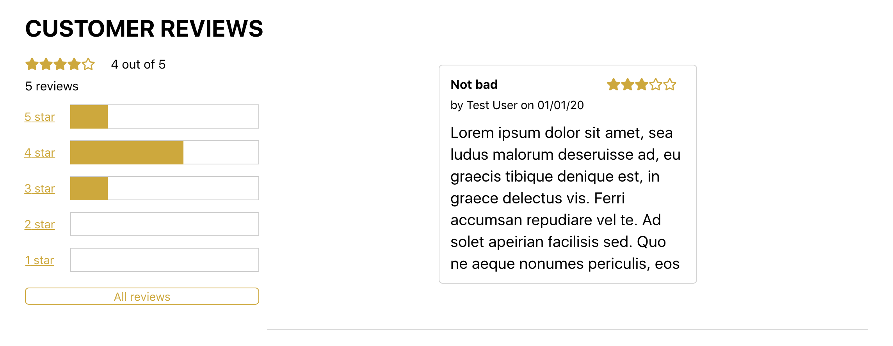
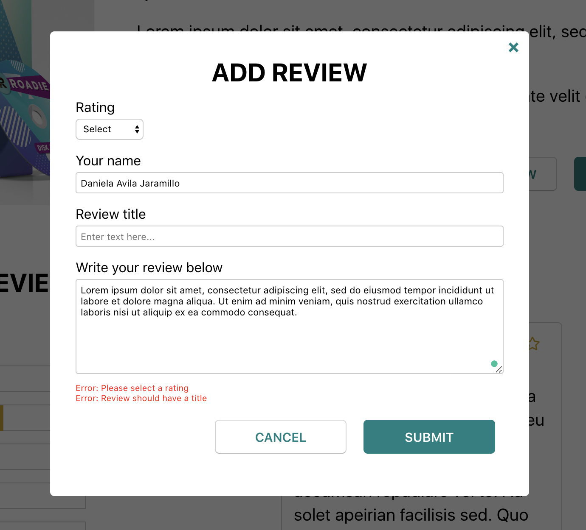
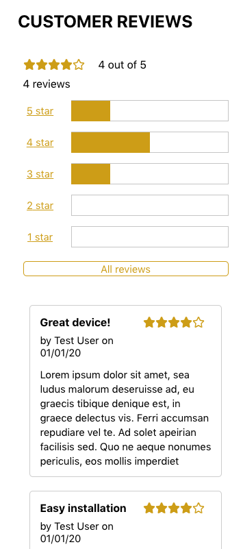

# Roadie Coding Challenge
Interactive product review page for Roadie Communicator

## Features and Functionality
* Existing reviews loaded dynamically via ajax

* Rating Summary:
    * Overall average star rating
    * Rating bars display number of reviews per star rating
    * Auto updates when new review is added
    * Rating summary made sticky for context
    * Filtering of reviews per star rating 
    
     
    
* Modal:
    * Fields validated before submiting form
    * New review added to reviews list and displayed
    
     
    
* Review Card:
    * New review card's date autopopulated with current date
    * Scrollable text
    
* Responsive design: Big screens, laptops, tablets, phones

     
    
## Technology
* React
* Javascript
* HTML/CSS

